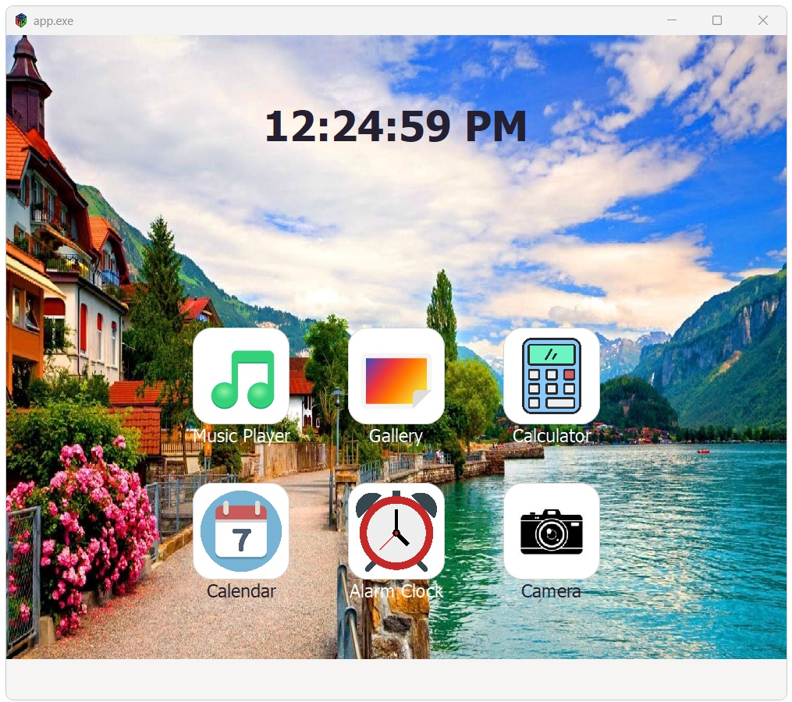
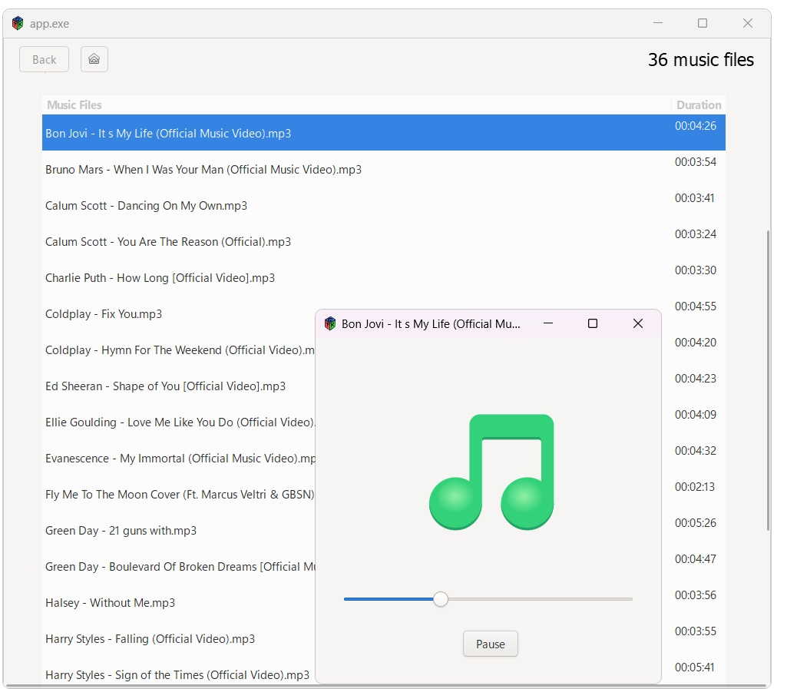
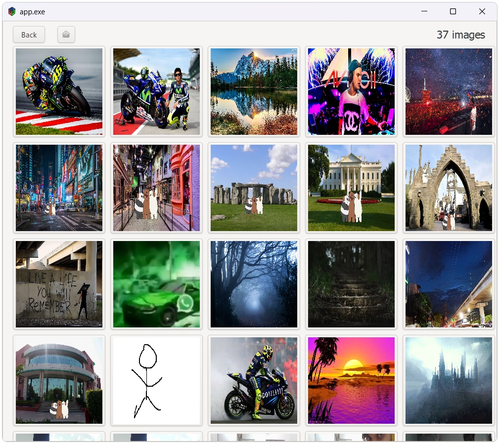
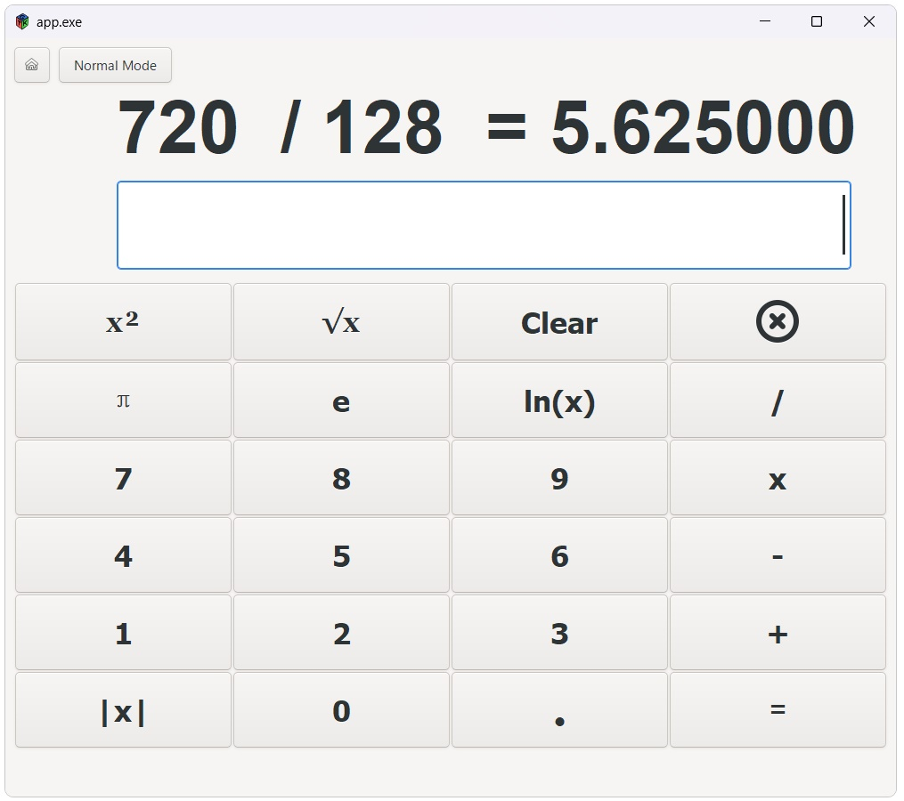
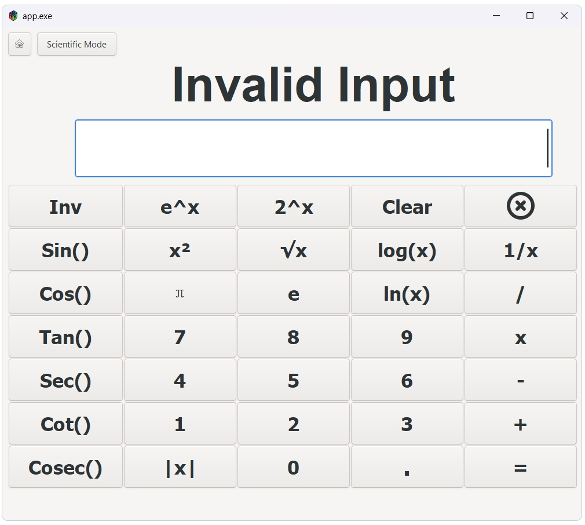
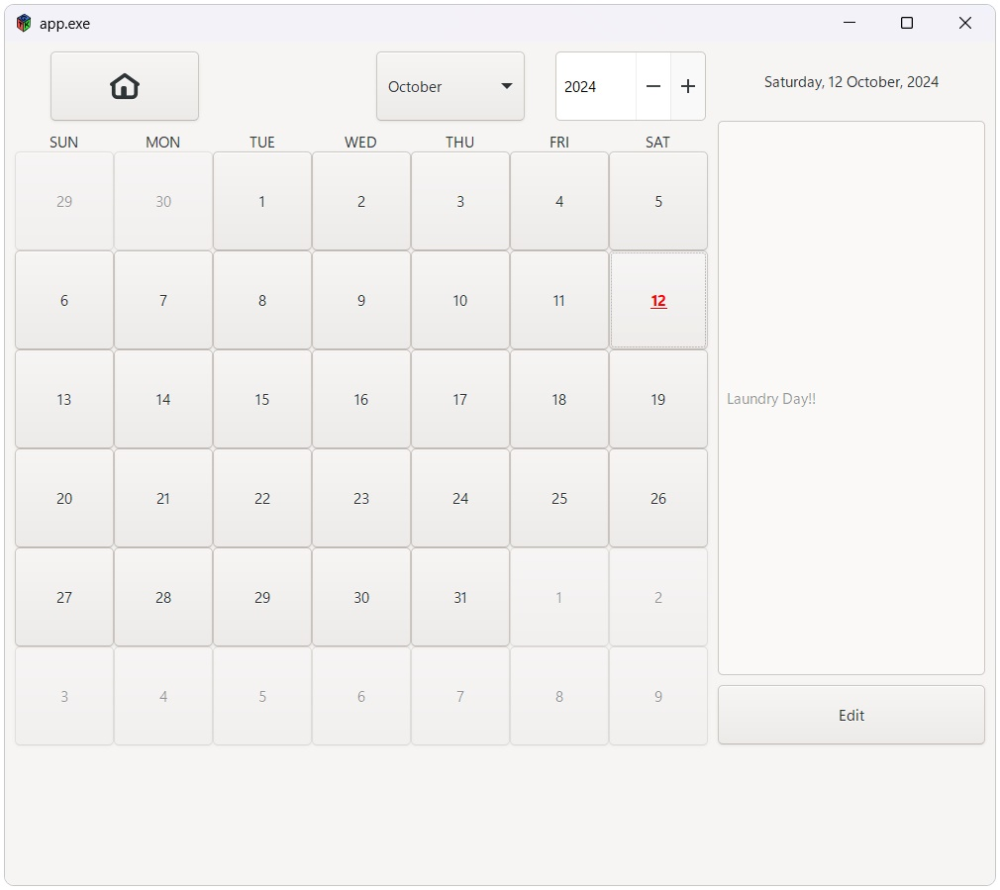

# Explorer Application
A simple user interface containing apps named calender, calculator, music player, alarm clock, gallery and camera 
written completely in C language using GTK3 toolkit and SDL2(for playing music)
<table style="width: 100%; border: 0; border-spacing: 0; padding: 0;">
  <tr>
    <td style="border: 0;"></td>
    <td style="border: 0;"></td>
  </tr>
  <tr>
    <td style="border: 0;"></td>
    <td style="border: 0;"></td>
  </tr>
  <tr>
    <td style="border: 0;"></td>
    <td style="border: 0;"></td>
  </tr>
</table>

### Project overview
* This project is a user friendly environment providing UI to use applications such as calender, calculator, music player, alarm clock, gallery and camera written completely in C language using GTK3 toolkit

* The applications are added on a GtkStacks and the stack is added to the main window, we can toggle between these stacks to easily move between applications

* GTK serves as the primary graphical user interface toolkit and it completely handles the UI building of this application. It uses various GtkWidgets such as windows, grid layouts, text views and buttons and arranges them accordingly 

### Features
* Applications like calculator for computing mathematical expressions,music player to list the music files and play the when clicked, calendar for checking dates and adding label to certain dates, alarm clocks for ringing alarms set for particular times, gallery to view camera roll images stored on the pc and camera to open pc camera to capture images

* User friendly interface with applications placed on grid, having option to toggle between applications with back buttons and home buttons

* The home page is scalable to add more applications and can be easily used

* Calculator app can be used to complex many mathematical function like the basic 4 opearations and transcedental functions like sine, tan, log, exp etc.

* Music player app lists your directory music files and those files can be played by clicking them

* Gallery app lists all the camera roll images on a grid and can be seen. These images can further be maximized onto new screen by clicking them

* Calender app shows the days of the months and the current date is highlighted. We can add label to dated which gets stored and can be accessed by clicking on the dates. It also provides a menu to go to a certain date

* Alarm clock sets the alarm to the set time and rings when time is up

### How to execute
To build on Windows, follow the steps:
* Recommended to use [MSYS2](https://www.msys2.org/) which provides a Unix-like environment and a command-line interface for compiling and building on Linux software that runs on Windows.
* Run the `MinGW64` environment that comes with `MSYS2`.
* Install `gtk3` for the `MINGW64` environment:  
```
pacman -S mingw-w64-x86_64-gtk3
```
* Install `SDL2` and `SDL2_mixer`
```
pacman -S mingw-w64-x86_64-SDL2 mingw-w64-x86_64-SDL2_mixer
```
* Install `ffmpeg`
```
pacman -S mingw-w64-x86_64-ffmpeg
```
* Compile app.c
```
gcc app.c -o app $(pkg-config --cflags --libs gtk+-3.0) $(pkg-config --cflags --libs SDL2_mixer) -Wno-deprecated-declarations -Wl,--export-all-symbols -lavformat -lavcodec -lavutil -lswresample
```
* Run the compiled file:
```
./app.exe
```

### Usage
* Upon launching the application, you will be presented with a grid layout of applications

* To use any app just click on the application the app window will open 

* You can use the back buttons and home button placed on application window to toggle between applications and to return to homescreen immediately

